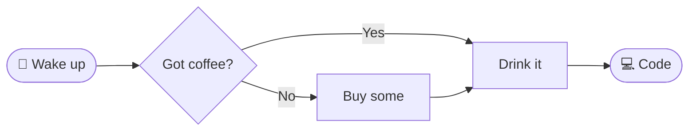

## Ⓜ️⬇ Markdown `.md` 

**Markdown** is a technology for creating text documents, just like **MS Word**, but there are more differences than similarities between these tools.

### Advantages and specifics of Markdown:

- **Web-oriented**. It converts to **HTML**, but is simpler and more readable. The easiest way to publish content on the web.
- **Lightweight and universal**. Plain text file, open it in any editor. Handle it from the terminal _(`grep`, `sed`)_, process it with a Python script, generate it automatically from data. No specialized software needed.
- **Open format**. An `.md` file is plain, readable text. No binary junk, no license, no vendor lock-in. You can open it in any editor, in 30 years, on any system.
- **AI collaboration**. Plain text means smaller context for the model: cheaper, faster, more accurate. AI understands and generates Markdown natively. Documentation, READMEs, specifications come out ready to go.
- **Linking instead of copying**. You easily build a network of documents that reference each other. One fragment lives in one place and you link to it from ten others.
- **Separation of form and content**:
  - The document's style _(appearance)_ doesn't live in the file, but in the rendering engine _(VSCode, GitHub, GitLab)_. This makes it easy to enforce a uniform look across the whole organization, and documents/articles transferred between companies/journals automatically inherit the style of the new location.
  - The style _(template)_ can't be broken, because it physically isn't in the document.
  - The author focuses on content, not formatting. Fewer errors, higher substantive quality. Because content is usually what matters!
- **GIT works natively**. Since `.md` is plain text, the version control system handles it the same way as source code. You get:
  - **Change history**. You see who changed what and when, line by line _(`git blame`)_.
  - **Collaboration**. Multiple people work in parallel, merge combines the changes automatically.
  - **Autobackup**. Roll back to any previous version.
  - **Branching**. One person writes chapter 1, another writes chapter 2, you merge it at the end.
  - **Tag / Release**. A snapshot of the entire set of related documents at a single point in time _(e.g. product manual at version `v1.2.0`)_.

### Advantages and specifics of MS Office:
  
- **Print-oriented**. The best solution for preparing documents for print.
- Low barrier to entry, being a simple and intuitive tool for creating documents.
- High popularity, meaning more people are able to edit these documents.
- **Comments and reviews** - built-in change tracking and commenting mode. Works well for short sessions and one-off reviews, but with long-term collaboration among many people it quickly becomes chaos.
- **Templates** - ready-made templates for corporate documents, contracts and official letters: open and fill in, zero configuration.
- **Form and content combined** - you see exactly what you'll print _(WYSIWYG)_. Precise control over margins, page breaks, headers and footers without any syntax.
  - **Rich editing capabilities** - beyond text formatting, it offers image, chart, table and other visual element editing, all in one place.
- **Spell checker** that catches spelling errors.

### Working with Markdown

#### Editing

Markdown is best edited in the same editor you already work in: [**VSCode**](https://code.visualstudio.com/), [Sublime Text](https://www.sublimetext.com/), [Vim](https://www.vim.org/), [Notepad++](https://notepad-plus-plus.org/). You don't need a separate application, a preview plugin is enough. For VSCode, [Markdown All in One](https://marketplace.visualstudio.com/items?itemName=yzhang.markdown-all-in-one) works great, providing live preview, keyboard shortcuts and automatic list formatting. Open preview with `Ctrl+Shift+V` or `Ctrl+K V` _(side-by-side)_.

#### Preview and publishing

On Windows without an editor, [**mdview**](https://github.com/c3er/mdview/releases) works as a lightweight `.md` file viewer. Platforms like [**GitHub**](https://github.com) and [GitLab](https://gitlab.com) automatically render `.md` files. The `readme.md` file in a repository directory displays as the project's main page, making it the most common way to publish documentation, guides, and articles.

#### Conversion

[**Pandoc**](https://pandoc.org/installing.html) is a command-line tool for converting between document formats. It lets you generate a ready `.docx` or `.pdf` from an `.md` file with a single command.
```sh
# Convert to Word
pandoc document.md -o document.docx
# Convert to PDF (requires LaTeX or wkhtmltopdf installed)
pandoc document.md -o document.pdf
```

Useful when you need to hand off documentation as `.docx` to a client who doesn't know Markdown.

#### All-in-One

If someone really wants everything in one tool, I recommend [Typora](https://typora.io). One-time cost is just `$15`. And if someone's broke, there's always [Marktext](https://github.com/marktext/marktext).

# Syntax

Below you'll find Markdown **markers**, i.e. syntax elements, both more and less useful ones.

## Headings

To create a heading, place `#` at the beginning of a new line. The number of `#` characters corresponds to the heading level.

```md
# Title
## Chapter
### Subchapter
#### Section
##### Subsection
```

To strongly separate sections of text without adding a heading, you can insert a horizontal rule:

```
---
```

---

## Text emphasis

You can emphasize important parts of text in several ways

```md
**Bold text**
_Italic text_
`Text as code`
~~Strikethrough text~~
==Highlighted text==
> Text as blockquote
```

**Bold text**

_Italic text_

`Text as code`

~~Strikethrough text~~

==Highlighted text==

> Text as blockquote

### Subscript and superscript

```md
Subscript: H~2~O
Superscript: x^2^
```

Subscript: H~2~O
Superscript: x^2^

## Lists

#### Bullet list

```md
- Saltpeter 74.64%
- Charcoal 13.51%
- Sulfur 11.85%
```

- Saltpeter 74.64%
- Charcoal 13.51%
- Sulfur 11.85%

#### Numbered list

```md
1. Collect $25000
2. Invest in Bitcoin
3. Be broke again
```

1. Collect $25000
2. Invest in Bitcoin
3. Be broke again

#### Multi-level list

You can create multi-level lists and mix list types

```md
1. **Python** programming course
  - Environment setup
  - Learning basics
    - Variables and basic operations
    - Conditional statements `if`...`else`
    - Loops `while` and `for`
  - QUIZ project with custom questions
2. **Markdown** document training
  1. Learning syntax elements
  2. Creating your own blog, course or cookbook
```

1. **Python** programming course
  - Environment setup
  - Learning basics
    - Variables and basic operations
    - Conditional statements `if`...`else`
    - Loops `while` and `for`
  - QUIZ project with custom questions
2. **Markdown** document training
  1. Learning syntax elements
  2. Creating your own blog, course or cookbook

### Task list

```
- [x] Go hang out with friends
- [ ] Study for the exam
- [ ] Prepare the project for grading
```

- [x] Go hang out with friends
- [ ] Study for the exam
- [ ] Prepare the project for grading

## Definitions

A special syntax was developed for explaining terms and formulating definitions.

```
Noob
: A colloquial term, especially common in gaming and internet culture, referring to a newcomer or someone who did something foolish. The term is versatile and carries various connotations. Its popularity has been growing steadily since the early 2000s.
```

Noob
: A colloquial term, especially common in gaming and internet culture, referring to a newcomer or someone who did something foolish. The term is versatile and carries various connotations. Its popularity has been growing steadily since the early 2000s.

## Footnotes

When you want to reference terms and phrases in the text that will be explained at the bottom of the document, you can use the `[^x]` syntax, where `x` is the footnote number.

```
**The C language** saw the light of day in 1972 and despite its advanced age is still widely used.
There are of course many other languages on the market, usually easier for programmers,
but C still has no equal in many applications [^1].

[^1]: _C Programming Absolute Beginner's Guide_, Greg Perry, Dean Miller, 2013
```

**The C language** saw the light of day in 1972 and despite its advanced age is still widely used.
There are of course many other languages on the market, usually easier for programmers,
but C still has no equal in many applications [^1].

[^1]: _C Programming Absolute Beginner's Guide_, Greg Perry, Dean Miller, 2013

## Links

To navigate to another document/file, you need to create a **hyperlink**. It can point to documents or other files located locally in the document's folder, as well as to content available on the internet. The syntax is the same for both, only the address/path differs.

```
[Link to a local file](./path/to/file.md)
[Link to an internet file](https://some-website.com)
[Link to a heading in this file](#some-header)
```

[Link to a local file](./xaeian.png)

[Link to an internet file](https://google.com)

[Link to a heading in this file](#headings)

If you want the content of a document or file to appear in this document _(be copied into it)_, just place `!` before the link

```


```

### Images

Embedding content from a given path is a great way to display graphics. Just like links, images can be placed locally in the document's folder or fetched from the internet.

```

```


### Tables

A characteristic of Markdown is that the source code itself should resemble the original document as closely as possible, so even without a converter that renders it nicely, the document is relatively readable. This becomes especially apparent when creating tables, which are built using `|`, `-` and `:` characters, where the last one indicates alignment.

```
|  No   | Country              |         Area |     Population |
| :---: | :------------------- | -----------: | -------------: |
|   1   | Russia               |   17 098 242 |    146 238 185 |
|   2   | Canada               |    9 984 670 |     37 943 231 |
|   3   | China                |    9 596 960 |    332 403 650 |
|   4   | United States        |    9 525 067 |  1 411 778 724 |
|   5   | Brazil               |    8 515 767 |    217 240 060 |
```

Largest countries in the world:

|  No   | Country              |         Area |     Population |
| :---: | :------------------- | -----------: | -------------: |
|   1   | Russia               |   17 098 242 |    146 238 185 |
|   2   | Canada               |    9 984 670 |     37 943 231 |
|   3   | China                |    9 596 960 |    332 403 650 |
|   4   | United States        |    9 525 067 |  1 411 778 724 |
|   5   | Brazil               |    8 515 767 |    217 240 060 |

## Code block

Markdown was originally created as a tool for writing programmer documentation, so it's no surprise that it supports embedding code blocks with syntax highlighting for many languages. Place the code between ` ``` ` tags and optionally specify the language.

#### Code block in Python

````md
```py
a = "5"
b = 10
c = a + str(b) # string concatenation
print(c)
d = b + int(a) # int addition
print(d)
```
````

```py
a = "5"
b = 10
c = a + str(b) # string concatenation
print(c)
d = b + int(a) # int addition
print(d)
```

## Emoji

You can copy emoticons _(e.g. [from here](https://emojidb.org/))_ and place them directly in the document, or use their codes.

```
👍 + :heart:
```

👍 + :heart:


## Math formulas

Markdown supports math formulas in **LaTeX** notation. Inline formulas go between `$...$`, block formulas between `$$...$$`. Supported by GitHub, Obsidian, Jupyter Notebook.

```md
Inline formula: $E = mc^2$, square root: $\sqrt{a^2 + b^2}$

$$
\sum_{i=1}^{n} x_i = x_1 + x_2 + \cdots + x_n
$$
```

Inline formula: $E = mc^2$, square root: $\sqrt{a^2 + b^2}$

$$
\sum_{i=1}^{n} x_i = x_1 + x_2 + \cdots + x_n
$$

## Diagrams

**Mermaid** is a syntax for creating diagrams directly in Markdown: `flowchart`s, `sequenceDiagram`s, `gantt` and more. Supported by GitHub, GitLab and Obsidian.

````md

````



## Callouts

Highlighted blocks to catch the reader's attention. Warnings and important information that can't be missed.

```md
> [!NOTE]
> `readme.md` is automatically displayed as the repository page.

> [!WARNING]
> Don't commit passwords and API keys to the repository.
```

> [!NOTE]
> `readme.md` is automatically displayed as the repository page.

> [!WARNING]
> Don't commit passwords and API keys to the repository.

## Metadata

At the start of an `.md` file you can place a metadata block in [**YAML**](https://yaml.org) format, separated by `---` lines. The metadata itself isn't rendered in the content, but it's used by tools for generating PDFs, static sites _(Jekyll, Hugo)_ or corporate document templates _(e.g. header, footer, version number)_.

```md
---
title: Markdown Intro
author: Xaeian Emilian Świtalski
version: 1.4.2
date: 2026-04-15
---
```

Keys are arbitrary, they depend on the engine reading the document. Typical fields are `title`, `author`, `date`, `tags`, `version`. GitHub and VSCode render the block as a table above the content, Pandoc inserts `title` and `author` onto the title page when converting to `.docx` or `.pdf`.

## Escaping

To disable Markdown syntax and display a character literally, precede it with a backslash `\`.

```md
\*this text won't be italic\*
\# this is not a heading
\`this is not code\`
```

\*this text won't be italic\*

\# this is not a heading

\`this is not code\`

## Markdown and HTML

Markdown is a shorthand for HTML, every syntax element has its counterpart:

| Markdown          | HTML                            | Result         |
| :---------------- | :------------------------------ | :------------- |
| `# Heading`       | `<h1>`Heading`</h1>`            | **big title**  |
| `**bold**`        | `<strong>`bold`</strong>`       | **bold**       |
| `_italic_`        | `<em>`italic`</em>`             | _italic_       |
| `[link](url)`     | `<a href="url">`link`</a>`      | [link](url)    |
| `` | ``         | 🖼️              |

An intermediate format, Markdown leverages existing technology instead of reinventing the wheel. Every new renderer _(VSCode, GitHub, MkDocs, Pandoc)_ automatically supports your old `.md` files.

# Project

The project involves creating your own document/project in **Markdown**, which will be one of:

- A **tutorial** covering a chosen topic, consisting of a title page and at least three lessons.
- A **cookbook** with a title page about cooking and nutrition with three recipes.
- A **travel guide** for a chosen city or location, with a general description and three most interesting spots.
- A **blog** consisting of a title page about yourself or a fictional character, with three posts.

Minimum project requirements:

- [ ] Every project/document must consist of a **main file** `readme.md` and at least **three additional** `.md` files.
- [ ] [Text emphasis](#text-emphasis) must be used consistently throughout the text.
- [ ] Every page/file must contain at least **one graphic**/image _(graphics must be stored locally in the project)_.
- [ ] The project as a whole must contain at least **two lists** (bullet/numbered).
- [ ] The project must contain at least **one table**.
- [ ] The project must contain at least **one external link**.