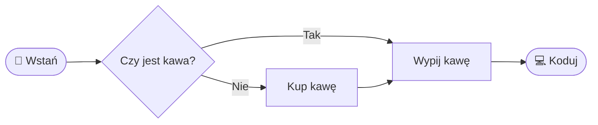

## Ⓜ️⬇ Markdown `.md` 

**Markdown** jest technologią przeznaczonado tworzenia dokumentów tekstowych, czyli tak jak **MS Word**, jednak różnic między tymi narzędziami jest więcej niż podobieństw.

### Zalety i specyfika Markdown:

- **Zorientowany pod internet**. Jest konwertowany na **HTML**, ale jest znacznie od niego prostszy i bardziej czytelny, co czyni go najłatwiejszym sposobem publikowania treści w internecie.
- Pliki markdown są lekkie i nie wymagając specjalistycznego oprogramowania _(wystarczy jakikolwiek edytor tekstu)_
- **Otwarty format** - plik `.md` to czysty, czytelny tekst. Żadnych binarnych śmieci, żadnej licencji, żadnego vendor lock-in. Otworzysz go w każdym edytorze, za 30 lat, na każdym systemie.
- **Współpraca z AI** - czysty tekst to mniejszy kontekst dla modelu: taniej, szybciej, dokładniej. AI rozumie i generuje Markdown natywnie, dokumentacja, README, specyfikacje wylatują gotowe.
- **Oddzielenie formy od treści**:
  - Wymuszenie jednolitego stylu dokumentów we wszystkich sekcjach organizacji jest praktykowane. Nawet podczas przenoszenia i integracji dokumentacji między różnymi firmami, zachowany zostaje spójny styl. Ten styl zależy od silnika odpowiedzialnego za prezentację, który jest zintegrowany z narzędziami do edycji, takimi jak VSCode, oraz platformami publikacyjnymi, takimi jak GitHub czy GitLab.
  - Pozwala to skoncentrować się na treści dla osób tworzących dokumenty, co może zminimalizować liczbę błędów i zwiększyć jakość dokumentów pod względem merytorycznym.
- Pliki tekstowe z prostym formatowaniem, co pozwala na integracje **systemu kontroli wersji GIT**, co przynosi szereg korzyści:
  - **Historia zmian** - umożliwia śledzenie, kto i kiedy dokonał zmian, co pozwala prześledzić historię dokumentu i zidentyfikować różnice między wersjami, ułatwiając zrozumienie zmian.
  - **Współpraca** - ułatwia pracę zespołową, umożliwiając wielu osobom równoczesną pracę nad dokumentem.
  - **Autobackup** -  umożliwia przywrócenie poprzednich wersji, jeśli nowe zmiany są niepożądane.
  - **Rozgałęzienia _(branching)_** - pozwala na jednoczesną pracę nad różnymi rozdziałami.
  - **Oznaczanie autorów** - pokazuje, kto dokonał konkretnych zmian, zwiększając przejrzystość.

### Zalety i specyfika MS Office:
  
- **Zorientowany pod dokumenty papierowe**. Stanowi najlepsze rozwiązanie na przygotowanie dokumentów do druku.
- Niski próg wejścia, będąc prostym i intuicyjnym narzędziem do tworzenia dokumentów.
- Duża popularność, która sprawia, że więcej osób jest zdolne do edytowania tych dokumentów.
- **Komentarze i recenzje** - wbudowany tryb śledzenia zmian i komentowania. Sprawdza się przy krótkich sesjach i jednorazowych przeglądach, przy długotrwałej współpracy wielu osób szybko robi się chaos.
- **Szablony** - gotowe szablony dokumentów firmowych, umów i pism urzędowych: otwierasz i wypełniasz, zero konfiguracji.
- **Połączenie formy i treści** - widzisz dokładnie to co wydrukujesz _(WYSIWYG)_. Precyzyjna kontrola marginesów, podziałów stron, nagłówków i stopek bez żadnej składni.
  - **Bogate możliwości edycji** - oprócz formatowania tekstu, oferuje funkcje edycji obrazów, wykresów, tabel oraz innych elementów wizualnych, wszystko w jednym miejscu.
- **Słownik języka** sprawdzający pisownię, co zmniejsza liczbę błędów.

## Konwersja z Pandoc

[**Pandoc**](https://pandoc.org/installing.html) to narzędzie konsolowe do konwersji między formatami dokumentów. Pozwala wygenerować z pliku `.md` gotowy `.docx` lub `.pdf` jedną komendą.

```sh
# Konwersja do Word
pandoc dokument.md -o dokument.docx
# Konwersja do PDF (wymaga zainstalowanego LaTeX lub wkhtmltopdf)
pandoc dokument.md -o dokument.pdf
```

Przydatne gdy chcesz oddać dokumentację jako `.docx` klientowi, który nie zna Markdown.

# Syntax

Niżej w dokumencie znajdziesz znaczniki **Markdown**, czyli elementy składni, zarówno te bardziej, jak i mniej przydatne.

## Nagłówki

Aby utworzyć nagłówek, na początku nowej linii umieść `#`. Liczba użytych znaków `#` odpowiada poziomowi nagłówka.

```md
# Tytuł
## Rozdział
### Podrozdział
#### Sekcja
##### Podsekcja
```

Aby mocno wyodrębnić jakieś fragmenty tekstu bez dodawania nagłówka, możemy wstawić linię poziomą:

```
---
```

---

## Wyróżnianie tekstu

Możemy wyróżnić istotne fragmenty tekstu na kilka sposobów

```md
**Tekst pogrubiony**
_Tekst pochylony_
`Tekst jako code`
~~Tekst przekreślony~~
==Tekst podświetlony==
> Tekst jako cytat
```

**Tekst pogrubiony**

_Tekst pochylony_

`Tekst jako code`

~~Tekst przekreślony~~

==Tekst podświetlony==

> Tekst jako cytat

### Indeksy

```md
Index dolny: H~2~O
Index górny: x^2^
```

Index dolny: H~2~O
Index górny: x^2^

## Listy

#### Lista wypunktowana

```md
- Saletra 74.64%
- Węgiel drzewny 13.51%
- Siarka 11,85%
```

- Saletra 74.64%
- Węgiel drzewny 13.51%
- Siarka 11,85%

#### Lista numerowana

```md
1. Zebrać 100000zł
2. Zainwestować w Bitcoina
3. Znów być biednym
```

1. Zebrać 100000zł
2. Zainwestować w Bitcoina
3. Znów być biednym

#### Lista wielopoziomeowa

Można tworzyć listy wielopoziomeowe oraz łączyć rodzaje list

```md
1. Kurs programowania **Python**
  - Konfiguracja środowiska
  - Nauka podstaw
    - Zmienne i podstawowe operacje
    - Instrukcje warunkowe `if`...`else`
    - Pętle `while` oraz `for`
  - Projekt QUIZ'u z własnymi pytaniami
2. Szkolenia z dokumentów **Markdown**
  1. Poznanie elementów składni
  2. Stworzenie własnego bloga, kursu lub książki kulinarniej
```

1. Kurs programowania **Python**
  - Konfiguracja środowiska
  - Nauka podstaw
    - Zmienne i podstawowe operacje
    - Instrukcje warunkowe `if`...`else`
    - Pętle `while` oraz `for`
  - Projekt QUIZ'u z własnymi pytaniami
2. Szkolenia z dokumentów **Markdown**
  1. Poznanie elementów składni
  2. Stworzenie własnego bloga, kursu lub książki kulinarniej

### Lista zadań

```
- [x] Pójść z znajomymi na trzepak
- [ ] Nauczyć się na egzamin
- [ ] Przygotować projekt na zaliczenie
```

- [x] Pójść z znajomymi na trzepak
- [ ] Nauczyć się na egzamin
- [ ] Przygotować projekt na zaliczenie

## Definicje

Do objaśniania terminów oraz formułowania definicji została opracowana specjalna składnia.

```
Dzban
: Potoczne określenie w języku polskim, funkcjonujące zwłaszcza w mowie młodzieżowej, oznaczające głupka lub kogoś, kto zrobił coś głupiego. Epitet ten ma charakter wieloznaczny i przypisuje się mu różne skojarzenia. Wzrost popularności tego określenia został zaobserwowany w roku 2018.
```

Dzban
: Potoczne określenie w języku polskim, funkcjonujące zwłaszcza w mowie młodzieżowej, oznaczające głupka lub kogoś, kto zrobił coś głupiego. Epitet ten ma charakter wieloznaczny i przypisuje się mu różne skojarzenia. Wzrost popularności tego określenia został zaobserwowany w roku 2018.

## Przypisy

Gdy chcemy w tekście wskazywać na terminy i zwroty, które zostaną wyjaśnione na dole dokumentu, możemy zastosować składnię `[^x]`, gdzie `x` jest numerem przypisu.

```
**Język C** ujrzał światło dzienne w 1972 roku i pomimo zaawansowanego wieku wciąż jest powszechnie używany.
Na rynku istnieje oczywiście wiele innych języków, zazwyczaj łatwiejszych dla programistów,
jednak C wciąż nie ma sobie równych w wielu zastosowaniach [^1].

[^1]: _Język C - Programowanie dla początkujących_, Greg Perry, Dean Miller, 2013
```

**Język C** ujrzał światło dzienne w 1972 roku i pomimo zaawansowanego wieku wciąż jest powszechnie używany.
Na rynku istnieje oczywiście wiele innych języków, zazwyczaj łatwiejszych dla programistów,
jednak C wciąż nie ma sobie równych w wielu zastosowaniach [^1].

[^1]: _Język C - Programowanie dla początkujących_, Greg Perry, Dean Miller, 2013

## Linki

Aby przenieść się do innego dokumentu/pliku, należy stworzyć **hiperłącze**. Może ono prowadzić zarówno do dokumentów lub innych plików znajdujących się lokalnie w folderze z dokumentem, jak i do zawartości dostępnej w internecie. W składni obie opcje się nie różnią, jedynie adres/ścieżka mają inną postać.

```
[Link do pliku lokalnego](./path/to/file.md)
[Link do pliku w internecie](https://some-website.com)
[Link do nagłówka w tym pliku](#some-header)
```

[Link do pliku lokalnego](./xaeian.png)

[Link do pliku w internecie](https://google.com)

[Link do nagłówka w tym pliku](#nagłówki)

Jeżeli chcemy, aby zawartość dokumentu lub pliku znalazła się w tym dokumencie _(została do niego skopiowana)_, wystarczy przed linkiem wstawić znak `!`.

```


```

### Obrazy

Wstawianie zawartości z określonej ścieżki jest doskonałym sposobem na wyświetlanie grafik. Podobnie jak w przypadku linków, obrazy mogą być umieszczone lokalnie w folderze z dokumentem lub pobierane z internetu.

```

```


### Tabele

Cechą języka Markdown jest to, że kod sam w sobie ma jak najbardziej przypominać oryginalny dokument, dzięki czemu nawet bez konwertera, który przekształci go w ładny sposób, dokument jest stosunkowo czytelny. Szczególnie wyraźne staje się to podczas tworzenia w nim tabel, które budujemy ze znaków `|`, `-` i `:`, z których ostatni wskazujemy na wyrównanie.

```
|  Lp   | Państwo           | Powierzchnia | Liczba mieszkańców |
| :---: | :---------------- | -----------: | -----------------: |
|   1   | Rosja             |   17 098 242 |        146 238 185 |
|   2   | Kanada            |    9 984 670 |         37 943 231 |
|   3   | Chiny             |    9 596 960 |        332 403 650 |
|   4   | Stany Zjednoczone |    9 525 067 |      1 411 778 724 |
|   5   | Brazylia          |    8 515 767 |        217 240 060 |
```

Największe państwa świata:

|  Lp   | Państwo           | Powierzchnia | Liczba mieszkańców |
| :---: | :---------------- | -----------: | -----------------: |
|   1   | Rosja             |   17 098 242 |        146 238 185 |
|   2   | Kanada            |    9 984 670 |         37 943 231 |
|   3   | Chiny             |    9 596 960 |        332 403 650 |
|   4   | Stany Zjednoczone |    9 525 067 |      1 411 778 724 |
|   5   | Brazylia          |    8 515 767 |        217 240 060 |

## Blok kodu

Na początku Markdown został stworzony jako narzędzie do tworzenia dokumentacji dla programistów, więc nie powinno być zaskoczeniem, że wspiera umieszczanie bloków kodu wraz z kolorowaniem składni dla wielu technologii. Fragment kodu należy umieścić między tagami ` ``` ` oraz można wskazać język, w którym został napisany kod, ale nie trzeba.

#### Blok kodu w języku Python

    ```py
    a = "5"
    b = 10
    c = a + str(b) # łączenie str'ingów
    print(c)
    d = b + int(a) # dodawanie int'ów
    print(d)
    ```

```py
a = "5"
b = 10
c = a + str(b) # łączenie str'ingów
print(c)
d = b + int(a) # dodawanie int'ów
print(d)
```

## Wzory matematyczne

Markdown obsługuje wzory matematyczne w notacji **LaTeX**. Wzory inline umieszczamy między `$...$`, blokowe między `$$...$$`. Obsługują je GitHub, Obsidian, Jupyter Notebook.

```md
Wzór inline: $E = mc^2$, pierwiastek: $\sqrt{a^2 + b^2}$

$$
\sum_{i=1}^{n} x_i = x_1 + x_2 + \cdots + x_n
$$
```

Wzór inline: $E = mc^2$, pierwiastek: $\sqrt{a^2 + b^2}$

$$
\sum_{i=1}^{n} x_i = x_1 + x_2 + \cdots + x_n
$$

## Diagramy

**Mermaid** to składnia do tworzenia diagramów bezpośrednio w Markdown, `flowchart`'y, `sequenceDiagram`'y, `gantt` i inne. Obsługują ją GitHub, GitLab i Obsidian.

    ```mermaid
      flowchart LR
        A([🌅 Wstań]) --> B{Czy jest kawa?}
        B -->|Tak| C[Wypij kawę]
        B -->|Nie| D[Kup kawę]
        D --> C
        C --> E([💻 Koduj])
    ```



## Emoji

Emotikony możemy kopiwać _(np. [stąd](https://pl.piliapp.com/emoji/list/))_ i umieszczać bezpośrednio w dokumencie, jak również możemy stosować ich kody.

```
👍 + :heart:
```

👍 + :heart:

## Callouts

Wyróżnione bloki do przykucia uwagi czytelnika. Ostrzeżenia i ważne informacje których nie można przeoczyć.

```md
> [!NOTE]
> `readme.md` wyświetla się automatycznie jako strona repozytorium.

> [!WARNING]
> Nie commituj haseł i kluczy API do repozytorium.
```

> [!NOTE]
> `readme.md` wyświetla się automatycznie jako strona repozytorium.

> [!WARNING]
> Nie commituj haseł i kluczy API do repozytorium.

## Escaping

Aby wyłączyć składnię Markdown i wyświetlić znak dosłownie, poprzedź go ukośnikiem `\`.

```md
\*ten tekst nie będzie kursywą\*
\# to nie jest nagłówek
\`to nie jest kod\`
```

\*ten tekst nie będzie kursywą\*

\# to nie jest nagłówek

\`to nie jest kod\`

## Markdown a HTML

Markdown to skrót do HTML, każdy element składni ma swój odpowiednik:

| Markdown          | HTML                            | Wynik          |
| :---------------- | :------------------------------ | :------------- |
| `# Nagłówek`      | `<h1>`Nagłówek`</h1>`           | **duży tytuł** |
| `**pogrubiony**`  | `<strong>`pogrubiony`</strong>` | **pogrubiony** |
| `_pochylony_`     | `<em>`pochylony`</em>`          | _pochylony_    |
| `[link](url)`     | `<a href="url">`link`</a>`      | [link](url)    |
| `` | ``         | 🖼️              |

Format pośredni, Markdown korzysta z istniejącej technologii zamiast wynajdować koło na nowo. Każdy nowy renderer _(VSCode, GitHub, MkDocs, Pandoc)_ automatycznie obsługuje Twoje stare pliki `.md`.

# Projekt

Projekt obejmuje stworzenie własnego dokumentu/projektu w technologii **Markdown**, który będzie stanowić:

- **Tutoriala** obejmującego wybraną tematykę, składającego się z strony tytułowej oraz co najmniej trzech lekcji.
- **Książka kucharska** z stroną tytułową o gotowaniu i dietetyce z trzema przepisami.
- **Przewodnik turystyczny** po wybranym mieście lnnej lokacji, z ogólnym opisem oraz trzema najciekawszymi miejscówkami.
- **Blog** składający się ze strony tytułowej o nas lub fikcyjnej postaci, wraz z trzema wpisami.

Minimalne wymagania projektowe:

- [ ] Każdy projekt/dokument musi składać się z **pliku głównego** `readme.md` oraz przynajmniej **trzech plików dodatkowych** `.md`.
- [ ] Muszą być stosowane [wyróżnienia](#wyróżnianie-tekstu) w tekście w sposób spójny.
- [ ] Każda strona/plik dokumentu musi zawierać przynajmniej **jedną grafikę**/obraz _(grafiki muszą być umieszczone lokalnie w projekcie)_.
- [ ] Projekt w całości musi zawierać przynajmniej **dwie listy** wypunktowane/numerowane 
- [ ] Projekt musi zawierać przynajmniej **jedną tabelę**.
- [ ] Projekt musi zawierać przynajmniej **jeden link** zewnętrzny.